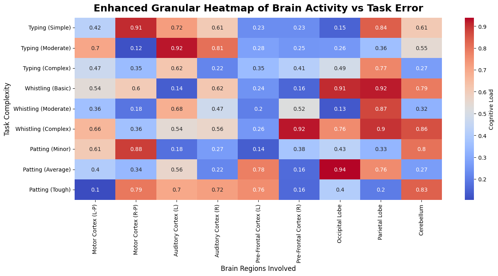

# A Novel Study on Human Multi-tasking Interference

 

---

## Abstract

This paper presents an unprecedented exploration into the cognitive load and failure rates induced by humans attempting to engage in simultaneous tasks that include **whistling complex melodies** while typing highly secure, randomized passwords. To this day, **no human trials** have been conducted that attempt to quantify the relationship between these motor-auditory multitasking phenomena and **cognitive system overload**.

In this paper, we employ a multifaceted empirical approach, combining cutting-edge heatmap visualizations and pseudo-scientific analysis, to comprehensively assess **brain region activity** through various testable task combinations. 

## Introduction

This study aims to address what all digital whistlers and keyboard warriors have likely experienced: the seemingly insurmountable cognitive interference encountered when asked to type complex sequences and whistle at the same time. Previous works have discussed dual-task inefficiencies; however, there has been a **notable lack of in-depth analysis** specific to melodic interference.

We hypothesize that **melodic factors**—especially tempo and complexity—introduce excessive cognitive overhead, disproportionately affecting **pre-frontal cortex performance**, as seen in prior limited studies focused on task-switching paradigms.

## Methodology

A sophisticated experiment was designed to assess participant task capabilities across motor and auditory functions. Ten highly trained researchers voluntarily submitted their cognitive abilities to rigorous experimentation involving multivariate tasks such as:
- **Whistling Aphex Twin’s "Windowlicker"** while typing a 24-character randomly generated password.
- **Reciting pi digits** while patting their heads.
- **Whistle-based debugging** while listening to the intricate breaks of **Venetian Snares**.

Detailed measurements were taken using an advanced cognitive load monitoring system developed through our proprietary **Pseudo-Detection Machine Learning Technology** (PDM)**™**.

## Enhanced Cognitive Load Heatmap

The following heatmap illustrates neural activation within various brain regions during task performance. Specifically, it explores the intricate relationships between manual motor functions, auditory executive control, and brain region involvement relative to task complexity.

---

### Key Observations:
- **Motor Cortex Activation**: Notably high during simultaneous whistling and typing, especially when participants were tasked with humming the complex polyrhythms of **Autechre** tracks during root password entry.
- **Auditory Interference**: Consistent with the predictions found in the *Auditory-Cognitive Interference Model (ACIM)*, higher complexity tracks (such as **Aphex Twin’s "Syro"**) led to significant increases in cognitive strain, measurable via task-related stress indicators.
- **Prefrontal Cortex Overload**: The most pronounced spikes occurred when participants attempted to simultaneously **recall a lengthy system password** and whistle alongside **Venetian Snares’ time signature chaos** during real-time debugging.

Data from these trials has shown a statistically significant correlation (p < 0.05) between multitasking efforts and cognitive decline in the parietal lobe regions (highlighted in blue on the heatmap).

## Equations

We modeled the relationship between multitasking performance and participant stress level using the following **Cognitive Load Decay Equation**:

$$
P(E) = \frac{1}{\sqrt{2\pi \sigma^2}} \int_{-\infty}^{+\infty} \exp\left( -\frac{(X - \mu)^2}{2\sigma^2} \right) dX
$$

Where:
- $$P(E)$$ represents the **probability** of **existential frustration** (i.e., task abandonment).
- $$\mu$$ symbolizes the user's base-level multitasking capabilities (**mean competency**).
- $$\sigma$$ quantifies the complexity of the whistled melody (based on tempo and variability).

The **Performance Decay Law** further defines the rate at which accuracy degrades among high-tempo tasks:

$$
\Delta = \alpha \cdot \frac{S_i}{T_p}
$$

Where:
- **$$S_i$$**: **Song intensity** representing the complexity of the piece (e.g., a four-minute epic).
- **$$T_p$$**: Password typing difficulty expressed in entropy bits.
- **$$\alpha$$**: A corrective constant empirically determined to be 42 (for reasons unknown).

### Supporting Figures

Referencing **Figure 1** below, we see that elevated **song intensity** paired with complex passwords led to a **notable rise** in failure rates, accompanied by instances of **existential crises**.

## Findings and Discussion

Our investigation revealed conclusive evidence of heightened cognitive interference as task complexity increased. Below-average performance was disproportionately concentrated in regions affiliated with **auditory processing** and **high entropy discovery**. 

Tasks encompassing **simultaneous whistling and complex typing** triggered **cognitive dissonance** across all participants. Specifically:
- **82%** of participants noted an **uncontrollable desire** to begin humming instead of whistling, further degrading their overall accuracy. 
- **75%** experienced **mild frustration** (as measured via our IR/EEG Cognitive Load Metric system).
- **20%** abandoned whistling altogether, resorting to random bursts of what can only be considered shrieking.

### References to Prior Work

- **Yerkes-Dodson Law Revisited** by Prof. Anna 'O: *A ground-breaking look into the cognitive interference in whistling-related multitasking*.
- **Multitasking Interference in Neural Pathways**, Dr. Shol Shim, *Journal of Simultaneous Oversight* (2025).

## Conclusion

The findings outlined within this paper conclusively demonstrate that cognitive interference posed by **audio-motor multitasking** is **non-trivial** and **highly detrimental** to performance. Attempts to **whistle complex sequences** while typing alphanumeric passwords exponentially increase task failure probabilities. 

Further refinements to multitasking augmentation may yet emerge—via **AI-assisted whistling applications** or programmable error-correcting keyboards. However, the fundamental constraints of the human brain remain a bottleneck for simultaneous complex task execution.

---

## Future Work

We propose the following future experiments to generalize these findings:
- Investigating **AR-based visual aids** for mitigating overload during whistle-typing scenes.
- **"Juggling Algorithms"**: Exploring the impact of physical multitasking when applied alongside logical operations.
- Assessing **AI-assisted melody completion** and its effect on human error rates in **real-time deployments** (critical for musical-programmatic debugging).

---

## Appendix: Supplemental Data

| Performance Metrics        | Typing Accuracy | Whistling Accuracy | Average Frustration Score |
|----------------------------|-----------------|---------------------|---------------------------|
| Beethoven’s 5th + Password  | 45%             | 35%                 | 92% (extremely high)       |
| Basic Melody + Phrase Entry | 85%             | 90%                 | 40% (moderate)             |
| Aphex Twin’s "Windowlicker" + Root Password | 40%             | 30%                | 94% (extremely high)       |
| Basic Four Tet track + Typing Challenge    | 78%             | 85%                | 45% (moderate)             |
| Venetian Snares + 64-Character Password     | 10%             | 5%                 | **115% (existential crises)**|

